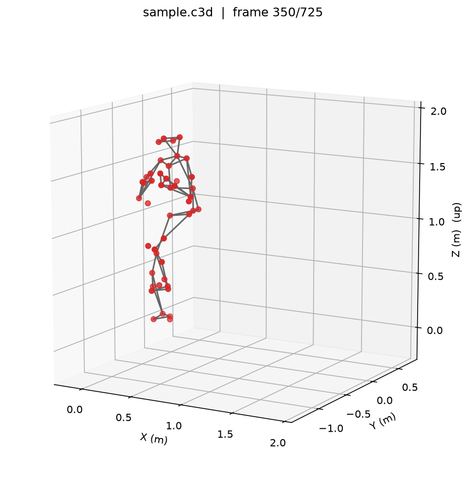
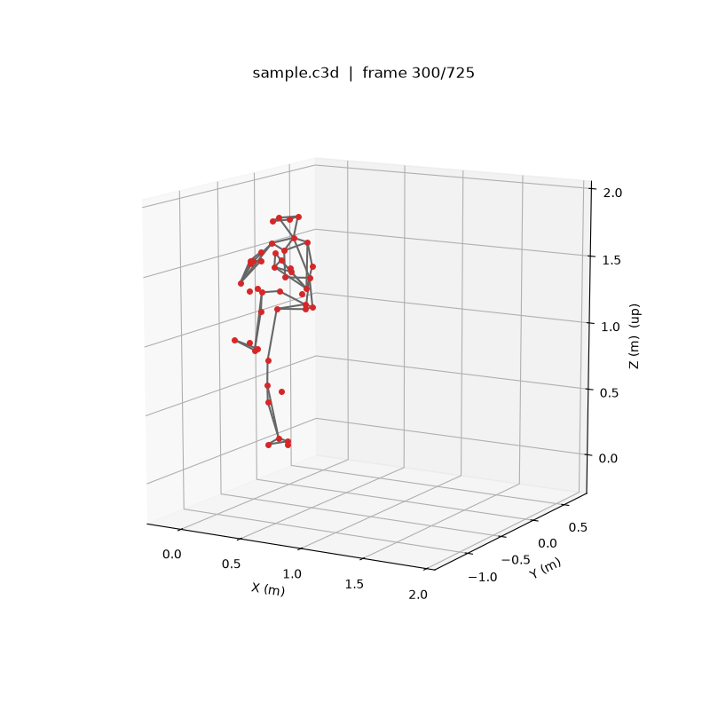
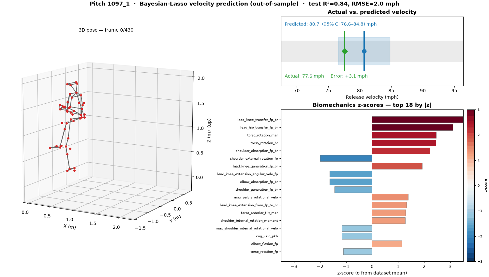

# Driveline Pitching — 3D C3D Plotter

A small, dependency-light Python module for **loading and plotting C3D
motion-capture files in 3D**, built for the
[Driveline OpenBiomechanics Project (OBP)](https://github.com/drivelineresearch/openbiomechanics)
baseball pitching dataset.

It reads the marker (point) trajectories from a `.c3d` file and renders them as
a 3D stick figure — either a single static frame or an animation across the
whole pitch — using the standard Vicon Plug-in-Gait marker set that the OBP
pitching data uses.



## Install

```bash
pip install -r requirements.txt
```

`ezc3d` is the preferred C3D reader. If it is not installed, the module
automatically falls back to the pure-python `c3d` package.

## Quick start

```python
import c3d_plot

# 1. (optional) Pull a C3D straight from the OpenBiomechanics repo
path = c3d_plot.download_obp_c3d(
    session="000002",
    filename="000002_003034_73_207_002_FF_809.c3d",
)

# 2. Plot a single frame as a 3D stick figure
c3d_plot.plot_c3d(path, frame=350, save_path="frame.png")

# 3. Animate the whole pitch to a gif (or .mp4 if ffmpeg is available)
c3d_plot.animate_c3d(path, step=2, save_path="pitch.gif")
```

The animation renders at real time by default (the capture rate, 360 Hz,
divided by `step`).



## Command line

```bash
# Static frame -> PNG
python c3d_plot.py path/to/file.c3d --frame 350 --out frame.png

# Animation -> GIF
python c3d_plot.py path/to/file.c3d --animate --step 2 --out pitch.gif

# Markers only (no skeleton), with marker-name labels
python c3d_plot.py path/to/file.c3d --no-skeleton --labels --out markers.png

# Add a polygonal dirt pitching mound under the pitcher
python c3d_plot.py path/to/file.c3d --animate --mound --out pitch_on_mound.gif
```

### Dirt pitching mound

Passing `mound=True` to `plot_c3d`/`animate_c3d` (or `--mound` on the CLI, and
on by default in the dashboard) draws a **polygonal dirt mound** under the
pitcher. The mound is derived entirely from the C3D foot markers
(`mound.py`): the center, radius, ground level, and the downhill heading toward
home plate are estimated from where the feet travel during the delivery, so the
dirt sits naturally under the pitcher for any pitch or capture orientation. It
is rendered as a polar grid of shaded dirt-colored quads — a flat plateau over
the footwork, a cosine-eased slope to the surrounding field, a slight crown, and
a white pitching rubber under the pivot foot.

## API

| Function | Purpose |
| --- | --- |
| `load_c3d(path)` | Load a `.c3d` into a `C3DMarkers` object (`points`, `labels`, `rate`, `units`). |
| `plot_c3d(source, frame=…, …)` | Render one frame as a 3D scatter + skeleton. |
| `animate_c3d(source, …)` | Animate a frame range; save to `.gif`/`.mp4` or return the animation. |
| `download_obp_c3d(session, filename)` | Fetch a single C3D from the OpenBiomechanics repo. |

`source` may be a file path or an already-loaded `C3DMarkers` instance.

### `C3DMarkers`

```python
mk = c3d_plot.load_c3d("file.c3d")
mk.n_frames          # number of frames
mk.n_markers         # number of markers
mk.rate              # sampling rate (Hz)
mk.units             # coordinate units, e.g. "m"
mk.labels            # list of marker names
mk.marker("RWRA")    # (n_frames, 3) trajectory for one marker
mk.points            # (n_frames, n_markers, 3) array; gaps are NaN
```

## Notes

- Coordinates are plotted with **Z up**, matching the OBP convention, and the
  axes use a 1:1:1 aspect so proportions are preserved.
- Marker gaps (stored as `(0,0,0)` in some files) and non-finite samples are
  converted to `NaN` and skipped when drawing.
- The skeleton is defined by `PLUG_IN_GAIT_SEGMENTS`. Segments are only drawn
  when both endpoint markers are present, so files with a reduced marker set
  still render. Pass `segments=None` to plot markers only, or supply your own
  list of `(label_a, label_b)` pairs.

## Velocity prediction + biomechanics dashboard

Beyond plotting the raw motion, the repo can **predict pitch release velocity
from the biomechanics** and present everything as a single animated dashboard:

1. the 3D pose animation,
2. the **actual vs. predicted release velocity** (with a posterior credible
   interval), and
3. **z-scores of every biomechanics metric**, colour-coded blue→red
   (below→above the dataset average).



```bash
# Train the model, fetch the pitch's C3D, and render the dashboard
python dashboard.py --out dashboard.gif

# Pick a specific pitch and show more z-score bars
python dashboard.py --pitch 1097_1 --top-n 24 --out dashboard.mp4
```

```python
from dashboard import build_dashboard
anim, info = build_dashboard(session_pitch="1097_1", save_path="dashboard.gif")
print(info)   # predicted/actual mph, error, out-of-sample flag, test R²/RMSE
```

### The model: a Bayesian Lasso with Gaussian priors

`bayesian_lasso.py` implements the Bayesian Lasso (Park & Casella, 2008) from
scratch in NumPy via Gibbs sampling. It uses the **scale-mixture-of-Gaussians**
representation of the Laplace prior: each coefficient gets a *Gaussian prior*
conditional on its own variance,

```
beta_j | sigma^2, tau_j^2  ~  Normal(0, sigma^2 * tau_j^2)
tau_j^2                    ~  Exponential(lambda^2 / 2)
```

Marginalising over `tau_j^2` recovers the double-exponential (Lasso) prior that
shrinks weak predictors toward zero, while every Gibbs full-conditional stays a
clean Gaussian / inverse-Gaussian / gamma draw. A Gamma hyper-prior on
`lambda^2` lets the data choose the shrinkage strength.

Trained on the 76 OpenBiomechanics POI metrics to predict `pitch_speed_mph`, it
reaches roughly **R² ≈ 0.8, RMSE ≈ 2 mph** out-of-sample.

```python
from bayesian_lasso import BayesianLasso
from velocity_model import load_dataset, train_velocity_model

trained = train_velocity_model()          # downloads POI data, fits, holds out a test set
print(trained.metrics)                     # {'r2': ..., 'rmse': ..., ...}
mean, std = trained.predict_pitch("1097_1")

# Inspect which biomechanics drive the prediction (posterior mean + 95% CI)
for row in trained.model.coef_summary(trained.dataset.feature_names)[:10]:
    print(row["feature"], round(row["mean"], 3), row["nonzero"])
```

`velocity_model.py` also computes per-pitch **z-scores** for every metric
(`dataset.zscores(session_pitch)`) and links a pitch to its raw C3D file through
`metadata.csv`.

> Note: POI metrics are end-of-pitch summary values, so the velocity prediction
> and z-scores describe the whole delivery; the pose panel animates the motion
> they summarise. Pitchers are a mix of left- and right-handed; the model uses
> biomechanics magnitudes and is not mirrored by handedness.

## Data & license

The C3D files belong to the OpenBiomechanics Project and are licensed
CC BY-NC-SA 4.0 (non-commercial). This repository contains only plotting code
plus small rendered demo assets; it does not redistribute the dataset. See the
[OBP repository](https://github.com/drivelineresearch/openbiomechanics) for the
data and its terms.
